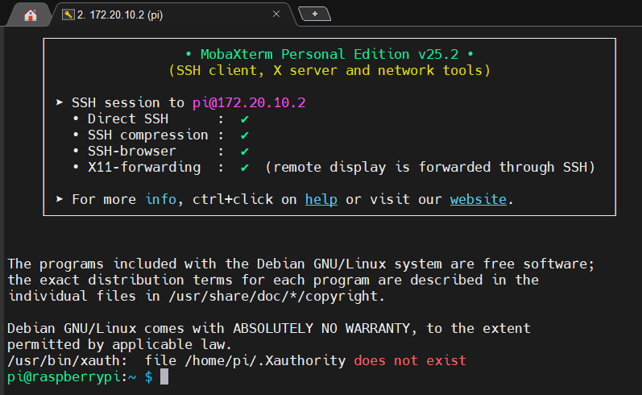
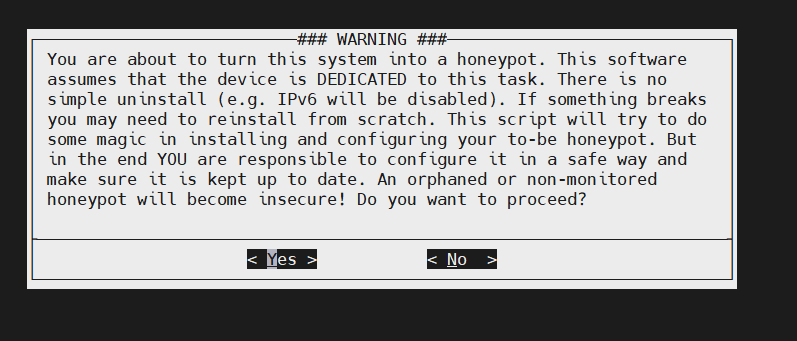
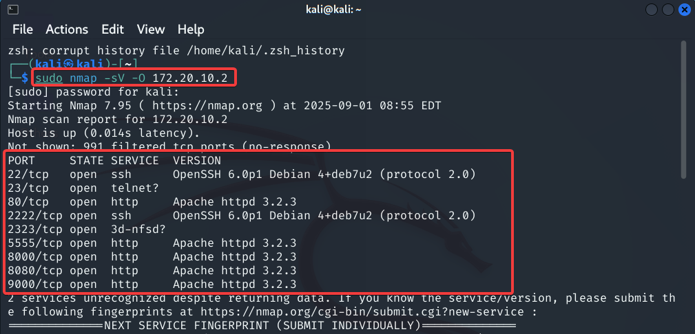
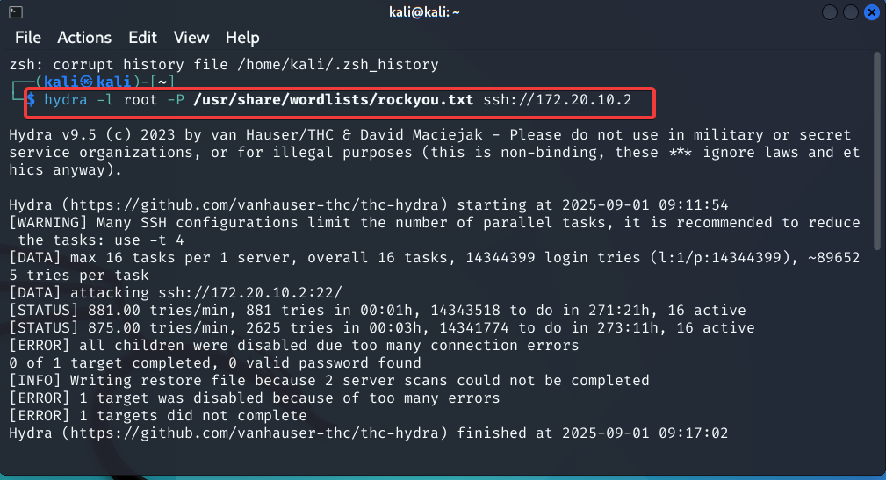

                
# Raspberry-Pi-Honeypot-DShield-Sensor

**Short description:**
This project turns a Raspberry Pi 4 into a DShield honeypot to capture and study network probes and brute-force attempts in a safe lab.

---

## Table of Contents

1. [Introduction](#introduction)
2. [Objective](#objective)
3. [Materials & Equipment](#materials--equipment)
4. [Methodology / Implementation](#methodology--implementation)
5. [Attacking the Honeypot (Local Tests)](#attacking-the-honeypot-local-tests)
6. [Results](#results)
7. [Conclusion](#conclusion)

---

## Introduction

This project converts a Raspberry Pi 4 into a low-interaction honeypot using the DShield (SANS ISC) sensor. The honeypot listens on many ports and records probes and login attempts. Logs are exported in CSV format and analyzed locally to study attacker behaviour in a safe environment. All testing was done inside a private lab network.

---

## Objective

* Install and configure a Raspberry Pi 4 as a DShield honeypot.
* Run local scans and simulated attacks (Kali Linux and Windows) to generate logs.
* Analyze logs (web + SSH/telnet) and produce charts and a short report.
* Keep tests on a private network for safety.

---

## Materials & Equipment

* Raspberry Pi 4 Model B (8 GB RAM)
* SanDisk Extreme A2 U3 microSD card — 64 GB
* SD card reader (USB Type-C)
* Main computer: Windows 11 (Raspberry Pi Imager, Zenmap)
* Kali Linux (VM) with tools: `nmap`, `hydra`, `nikto`, `msfconsole`
* Internet connection for downloads and DShield reporting
* DShield account (email + API key)

---

## Methodology / Implementation

### 1. Prepare the microSD and OS

* Write **Raspberry Pi OS Lite (64-bit)** using Raspberry Pi Imager.
* Set advanced options in the imager:

  * Hostname: `raspberrypi.local`
  * Username: `pi`
  * Password: *(your chosen password)*
  * Enable SSH and Wi-Fi (phone hotspot used for testing).
    
1 - *Raspberry Pi Imager — device selected (Pi 4).*
---


2 - *Choosing Raspberry Pi OS Lite (64-bit).*
---


3 - *Selecting the microSD card in the imager.*
---


4 -  *Advanced options: hostname, username, password, Wi-Fi.*
---


5 - *Enabling SSH before writing the image.*
---


6 - *Writing and verifying the SD card.*
---


7 - *Imager finished writing the SD card.*
---


---

### 2. Boot and initial connect

* Insert the microSD, power the Pi, and scan the local network:

```bash
nmap -sV -O 172.20.10.0/24
```

* Example Pi IP found: `172.20.10.2`.

*Zenmap / nmap showing Raspberry Pi IP (172.20.10.2).*
---


*Windows CMD ping successful to 172.20.10.2.*
---


*MobaXterm new SSH session (user: pi, host: 172.20.10.2).*
---


*SSH terminal connected to Raspberry Pi.*
---



---

### 3. Update system and install Git

```bash
sudo apt update && sudo apt upgrade -y
sudo reboot
sudo apt-get -y install git
```

*Running `sudo apt update && sudo apt upgrade`.*
---


---

### 4. Install DShield honeypot

```bash
git clone https://github.com/DShield-ISC/dshield.git
cd dshield/bin
sudo ./install.sh
```

During installation:

* Accepted warnings and privacy notice.
* Chose automatic updates.
* Entered DShield email and API key (verified).
* Configured interface (`wlan0`), admin IPs, admin port `12222`, firewall exceptions, honeypot exceptions (ports `2222 2223 8000`).
* Created SSL certificate with decoy details.
* Completed installation and rebooted.
  
*Cloning DShield repo on the Raspberry Pi.*
---


*Running `sudo ./install.sh` for DShield.*
---


*Installer warning about dedicated honeypot usage (accepted).*
---


*Privacy notice — data will be reported to DShield.*
---


*Choosing automatic updates.*
---


*Entering DShield email and API key (verified).*
---


*API Key verification successful.*
---


*DShield installation completed successfully.*
---


---

## Attacking the Honeypot (Local Tests)

> All tests were internal to the local lab network.

Performed scans and simulated attacks from Kali Linux and Windows:

* **Port & service scan (Kali):**

  ```bash
  sudo nmap -sV -O 172.20.10.2
  ```

  Observed many open ports: `22, 23, 80, 2222, 2323, 5555, 8000, 8080, 9000` (expected for a honeypot).

* **Nmap (Windows / Zenmap):** Confirmed the same open ports.

* **Nikto (web scan):**

  ```bash
  nikto -h http://172.20.10.2
  ```

* **Hydra (SSH brute-force simulation):**

  ```bash
  hydra -l root -P /usr/share/wordlists/rockyou.txt ssh://172.20.10.2
  ```

* **Metasploit Telnet brute-force (example):**

  ```
  msfconsole
  use auxiliary/scanner/telnet/telnet_login
  set RHOSTS 172.20.10.2
  set USERNAME root
  set PASS_FILE /usr/share/wordlists/top20.txt
  run
  ```

*Nmap results from Kali showing open ports on 172.20.10.2.*
---


*Hydra running SSH brute-force against the honeypot.*
---


*Nikto web scan output.*
---


---

## Results

**Log files produced**

* `web.csv` — **14,234** rows (web / HTTP related logs).
* `ssh.csv` — **8,218** rows (SSH/Telnet related logs).

**Key findings**

* A single internal test host (`172.20.10.3`) produced most web requests (14,227 of 14,234).
* Top web paths included: `/`, `/index.php`, `/admin`, `/robots.txt`, `/.git/HEAD`.
* SSH logs contained many attempted usernames and password strings. Many top password strings appear to contain protocol headers (SIP/VoIP fragments). This indicates some probes used non-HTTP payloads and that the logs include protocol-mixed entries.

---

## Conclusion

* The Raspberry Pi DShield honeypot was successfully installed and tested in a local lab.
* The honeypot recorded many probes and brute-force attempts; useful logs were collected for analysis.
* Some log fields contain noisy, protocol-mixed contents (e.g., SIP headers), so clean the data when producing final statistics.
* Recommended next steps: clean noisy rows, enable log rotation, keep backups, and (if ever exposing to the public) place the honeypot in a strict isolated network.

---
